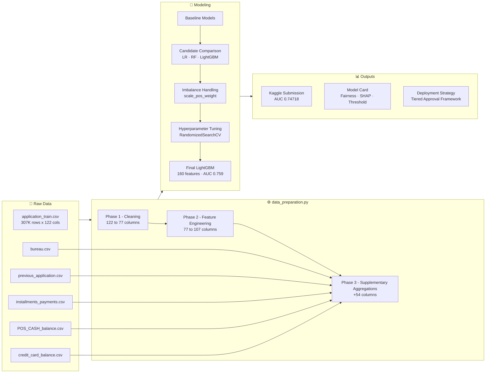

# Home Credit Default Risk: Predictive Credit Scoring for Underserved Borrowers

**Author:** Benjamin Hogan
**Tools:** Python · Polars · LightGBM · SHAP · Quarto
**Kaggle AUC-ROC:** 0.74718 &nbsp;|&nbsp; **Estimated Business Value:** +$47.3M over approve-all baseline

---

## Project Overview

Approximately 1.7 billion adults worldwide do not have access to formal financial services. In many cases this is not because they are poor credit risks, but because they have no credit history to evaluate. Home Credit Group serves this population, and the core challenge is figuring out which applicants are actually likely to repay when traditional credit scores are unavailable or incomplete.

Without reliable repayment signals, the company is left with a bad set of options: approve broadly and absorb default losses, or approve conservatively and turn away borrowers who would have paid. This project builds a machine learning pipeline to improve that decision.

Using application data, credit bureau records, and behavioral payment histories, the model identifies thin-file applicants who are likely to repay. The goal is to give Home Credit a practical screening tool, not just a prediction score. That means the project includes a production-ready data pipeline, a business-calibrated decision threshold, a full model card with fairness analysis, and a deployment recommendation with estimated financial impact.

- **Problem Type:** Binary classification (imbalanced, ~8% default rate)
- **Target Variable:** `TARGET` (1 = default, 0 = repaid on time)
- **Primary Metric:** AUC-ROC (robust to class imbalance)
- **Training Data:** 307,511 loan applications x 122 features
- **Test Data:** 48,744 loan applications x 121 features

---

## The Solution

The final model is a **LightGBM binary classifier** trained on 160 features pulled from seven raw data sources. The project was scoped from the start with deployment in mind, which shaped every decision from how the data pipeline was built to how the threshold was selected.

The pipeline works in three phases:

1. **Data Preparation.** Raw application data is cleaned, missing values are imputed using training-only parameters, and 45 domain-informed features are engineered from demographic, financial, and credit history signals.
2. **Supplementary Feature Integration.** Five behavioral tables covering bureau history, previous applications, installment payments, POS cash balances, and credit card activity are aggregated and joined to the main dataset, adding 54 features that reflect how applicants have actually managed past obligations.
3. **Modeling and Calibration.** LightGBM is selected through cross-validated comparison against logistic regression and random forest. Class imbalance is handled via `scale_pos_weight`. Hyperparameters are tuned with randomized search. The final model is evaluated by expected financial impact at an optimized decision threshold, not just by AUC.

The output is a **tiered lending recommendation** (auto-approve / human review / auto-deny) backed by SHAP explainability, ECOA-compliant adverse action language, and a fairness audit across gender and education groups.

---

## Business Value

A poorly calibrated lending strategy loses money in two directions: rejected applicants who would have repaid represent lost revenue, and approved applicants who default represent realized losses. This project quantifies both sides.

Using published cost benchmarks (McKinsey, 2020; Moody's, 2019):

- **Profit per repaid loan:** ~$934
- **Loss per default:** ~$10,500 (11.2x ratio)
- **Optimal decision threshold:** 0.63

At threshold 0.63, the model is estimated to generate approximately **$50.5M in net value** on the test population, which is a **$47.3M improvement** over the baseline of approving every applicant. The recommended deployment strategy is tiered:

| Score Band | Action | Rationale |
|---|---|---|
| Below 0.50 | Auto-approve | Low predicted risk; high expected profit |
| 0.50 to 0.75 | Human review | Borderline cases where underwriter judgment adds value |
| Above 0.75 | Auto-deny | High predicted default risk; expected net loss |

This framework is designed to be usable by underwriters, not just data scientists. It specifies where automation is appropriate and where a person should stay in the loop.

---

## Results at a Glance

| Metric | Value |
|---|---|
| Kaggle Public Leaderboard AUC-ROC | **0.74718** |
| Cross-Validation AUC-ROC | 0.759 |
| Precision (at threshold 0.63) | 0.241 |
| Recall (at threshold 0.63) | 0.412 |
| Approval Rate (at threshold 0.63) | 86.2% |
| Estimated Net Value vs. approve-all baseline | **+$47.3M** |

The CV AUC (0.759) and Kaggle AUC (0.747) are close, which is consistent with normal generalization on held-out data. There is no indication of overfitting.

---

## Pipeline at a Glance



---

## Repository Structure

```
home-credit-project/
├── README.md                  # This file
├── data_preparation.py        # Reusable cleaning & feature engineering module
├── modeling_notebook.qmd      # End-to-end modeling workflow (Quarto source)
├── model_card.qmd             # Structured model card (Quarto source)
└── home-credit-default-risk/  # Raw Kaggle data (not tracked in git)
    ├── application_train.csv
    ├── application_test.csv
    ├── bureau.csv
    ├── previous_application.csv
    ├── installments_payments.csv
    ├── POS_CASH_balance.csv
    └── credit_card_balance.csv
```

---

## Modeling Workflow (`modeling_notebook.qmd`)

The modeling notebook walks through each stage in order, with the reasoning behind each decision documented alongside the results.

### Stage 1 - Establishing Baselines

| Model | AUC-ROC |
|---|---|
| Majority class classifier (always predicts 0) | 0.5000 |
| Logistic Regression, EXT_SOURCE features only | 0.7177 |

The majority class classifier hits ~92% accuracy but scores 0.50 AUC, which is no better than a coin flip. This is why accuracy is not a useful metric for this problem. The logistic regression baseline sets a more honest performance floor: any model taken forward needs to beat 0.7177, the score you get from just three external credit bureau scores.

### Stage 2 - Candidate Model Comparison

Four models were compared using 3-fold stratified cross-validation on the full feature set. Stratification ensures the ~8% default rate is preserved in every fold.

| Model | Mean AUC-ROC | Std |
|---|---|---|
| **LightGBM (default params)** | **0.7664** | 0.0016 |
| Logistic Regression, full features | 0.7454 | 0.0022 |
| Logistic Regression, engineered features only | 0.7304 | 0.0029 |
| Random Forest | 0.7276 | 0.0013 |


LightGBM came out ahead by a clear margin. It handles missing values natively, picks up non-linear relationships without needing them to be explicitly engineered, and runs efficiently on a dataset this size. One interesting result: logistic regression on the full raw feature set beat logistic regression on engineered features only, which suggests the raw columns contain signal that the derived ratios alone do not cover.

### Stage 3 - Class Imbalance Handling

With only ~8% of loans defaulting, a model trained without any adjustment will learn to mostly ignore the minority class. Five strategies were tested on a 10,000-row stratified subsample:

| Strategy | Mean AUC-ROC |
|---|---|
| **Random undersampling** | **0.7097** |
| SMOTE | 0.7061 |
| No adjustment | 0.6956 |
| Random oversampling | 0.6915 |
| Class weights (`scale_pos_weight`) | 0.6903 |

Random undersampling scored highest on the subsample, but subsample results are noisy. `scale_pos_weight` was carried into full-dataset tuning because it works natively inside LightGBM without touching the training data, and it held up better at scale.

### Stage 4 - Hyperparameter Tuning

Randomized search over 20 parameter combinations with 3-fold CV was run on a 5,000-row subsample to keep compute manageable. The best parameters were then used to train on the full 307,511 rows.

| Feature Set | Mean AUC-ROC | Std |
|---|---|---|
| Tuned LightGBM, application features only | 0.7477 | 0.0026 |
| Tuned LightGBM + supplementary features | **0.7592** | 0.0024 |

### Stage 5 - Supplementary Feature Engineering

Application form data only captures a point in time. Behavioral history, how an applicant has actually managed past debt, is often more predictive. Five supplementary tables were aggregated to the applicant level and joined to the main feature matrix, adding 54 features (107 to 161 columns total):

| Table | Features Added | Key Signals |
|---|---|---|
| `bureau.csv` | 15 | Overdue counts, debt/credit ratios, active loan recency |
| `previous_application.csv` | 12 | Approval/refusal rates, prior credit amounts |
| `installments_payments.csv` | 12 | Late payment ratio, underpayment behavior |
| `POS_CASH_balance.csv` | 7 | DPD counts, late payment ratio |
| `credit_card_balance.csv` | 10 | Utilization rate, drawing behavior, CC DPD |

Adding these features moved CV AUC from 0.7477 to 0.7592, a gain of +0.0115. For thin-file borrowers especially, where credit bureau scores may be absent or sparse, payment behavior from other sources is some of the most useful signal available.

---

## Model Card (`model_card.qmd`)

The model card is a nine-section document covering the full lifecycle of the deployed model: what it does, how it performs, where it should and should not be used, who it may affect, and what the risks are. It is written for a mixed audience, including underwriters, compliance officers, and business stakeholders, not just technical readers.

| Section | Summary |
|---|---|
| **1. Model Details** | LightGBM gradient-boosted classifier, v1.0 (March 2026); 160 features; tuned hyperparameters with `scale_pos_weight` for class imbalance |
| **2. Intended Use** | First-pass credit screening for Home Credit underwriters. Not intended for fraud detection, portfolio stress testing, or fully automated decisions |
| **3. Performance Metrics** | CV AUC-ROC: 0.759 · Kaggle AUC-ROC: 0.747 · Precision: 0.241 · Recall: 0.412 · Approval rate: 86.2% at threshold 0.63 |
| **4. Decision Threshold Analysis** | Cost assumptions from McKinsey (2020) and Moody's (2019): ~$934 profit per repaid loan, ~$10,500 loss per default (11.2x ratio). Threshold 0.63 maximizes net value at ~$50.5M, a $47.3M improvement over approving all applicants |
| **5. Explainability** | SHAP analysis on a 1,000-row stratified sample. See chart below. Top predictors: `EXT_SOURCE_MEAN`, `EXT_SOURCE_2x3`, `LOAN_TO_VALUE_RATIO`, `INST_LATE_RATIO`, `NAME_EDUCATION_TYPE` |
| **6. Adverse Action Mapping** | Top SHAP features translated into ECOA-compliant plain-language denial reasons (e.g., "limited external credit history", "pattern of late installment payments") |
| **7. Fairness Analysis** | Female applicants approved at 88.4% vs. 81.9% for male. The gap is consistent with a 3.1pp difference in actual default rates. The education approval gap (91.9% for higher education vs. 81.7% for lower secondary) is larger than the default rate gap and is flagged for disparate impact review |
| **8. Limitations and Risks** | Missing EXT_SOURCE scores for borrowers with no bureau history; model trained on a static snapshot with no drift monitoring; uncalibrated probabilities; feedback loop risk from deployment; regulatory exposure from gender and education as direct inputs |
| **9. Executive Summary** | Deploy as a tiered screening tool: auto-approve below 0.50, human review 0.50 to 0.75, auto-deny above 0.75. The model misses 59% of actual defaults at this threshold. Financial estimates use industry benchmarks. Gender as a direct input requires legal review before production deployment |


---

## Data Preparation Module (`data_preparation.py`)

A reusable Python module for cleaning, transforming, and engineering features from the Home Credit dataset. All fit parameters (imputation medians, column lists) are computed from training data only and passed explicitly to the test pipeline to prevent data leakage. The module is fully documented with NumPy-style docstrings and can be imported into any downstream notebook or script.

### Installation

Requires Python 3.10+ and the following packages:

```bash
pip install polars scikit-learn lightgbm imbalanced-learn
```

### Quick Start

```python
import polars as pl
from data_preparation import (
    fit_params_from_train,
    prepare_application_data,
    aggregate_bureau,
    aggregate_previous_application,
    aggregate_installments,
    join_supplementary_features,
)

train = pl.read_csv("home-credit-default-risk/application_train.csv")
test  = pl.read_csv("home-credit-default-risk/application_test.csv")

# Fit parameters from training data only
params = fit_params_from_train(train)

# Apply the full cleaning and engineering pipeline
train_prepared = prepare_application_data(train, params, is_train=True)
test_prepared  = prepare_application_data(test,  params, is_train=False)

# Aggregate supplementary tables
bureau_agg = aggregate_bureau(pl.read_csv("home-credit-default-risk/bureau.csv"))
prev_agg   = aggregate_previous_application(pl.read_csv("home-credit-default-risk/previous_application.csv"))
inst_agg   = aggregate_installments(pl.read_csv("home-credit-default-risk/installments_payments.csv"))

# Join into final modeling datasets
train_final = join_supplementary_features(train_prepared, bureau_agg, prev_agg, inst_agg)
test_final  = join_supplementary_features(test_prepared,  bureau_agg, prev_agg, inst_agg)
```

---

## Pipeline Stages

### Phase 1 - Cleaning (`clean_application_data`)

| Transformation | Description |
|---|---|
| `DAYS_EMPLOYED` sentinel | 365,243 is a known placeholder for unemployed applicants. Replaced with null; a binary `DAYS_EMPLOYED_ANOM` flag preserves the signal |
| `AGE_YEARS` | `DAYS_BIRTH` is stored as a negative integer. Converted to positive years |
| `CODE_GENDER "XNA"` | Four rows with gender coded as "XNA" replaced with null |
| `OWN_CAR_AGE` | Null values for applicants without a car filled with 0 |
| EXT_SOURCE imputation | `EXT_SOURCE_1` (56% missing), `EXT_SOURCE_2` (0.2%), `EXT_SOURCE_3` (19.8%) imputed using training medians only |
| `OCCUPATION_TYPE` | Null values filled with "Unknown" |
| Housing columns | 47 columns with more than 50% missing data dropped |
| Credit bureau inquiries | Six `AMT_REQ_CREDIT_BUREAU_*` columns filled with 0 where null |

**Result:** 122 columns reduced to 77.

### Phase 2 - Feature Engineering (`engineer_features`)

| Category | Features |
|---|---|
| **Demographics** | `EMPLOYED_YEARS`, `REGISTRATION_YEARS`, `ID_PUBLISH_YEARS`, `PHONE_CHANGE_YEARS`, `EMPLOYED_TO_AGE_RATIO` |
| **Financial Ratios** | `CREDIT_INCOME_RATIO`, `ANNUITY_INCOME_RATIO`, `LOAN_TO_VALUE_RATIO`, `CREDIT_TERM_MONTHS`, `GOODS_TO_INCOME_RATIO` |
| **Missing Indicators** | Binary flags for columns where missingness carries predictive signal |
| **EXT_SOURCE Interactions** | `EXT_SOURCE_MEAN`, `EXT_SOURCE_1x2`, `EXT_SOURCE_1x3`, `EXT_SOURCE_2x3`, `EXT_SOURCE_1_SQ`, `EXT_SOURCE_2_SQ`, `EXT_SOURCE_3_SQ` |
| **Binned Variables** | `AGE_BIN` (5-year brackets), `CREDIT_INCOME_BIN` (quartile), `EXT_SOURCE_MEAN_BIN` (quartile) |

### Phase 3 - Supplementary Aggregations

| Function | Prefix | Key Features |
|---|---|---|
| `aggregate_bureau()` | `BUREAU_` | `BUREAU_COUNT`, `BUREAU_ACTIVE_RATIO`, `BUREAU_DEBT_CREDIT_RATIO`, `BUREAU_OVERDUE_RATIO`, `BUREAU_SUM_OVERDUE`, `BUREAU_MAX_OVERDUE`, `BUREAU_MEAN_DAYS_OVERDUE` |
| `aggregate_previous_application()` | `PREV_` | `PREV_APP_COUNT`, `PREV_APPROVAL_RATE`, `PREV_REFUSAL_RATE`, `PREV_AMT_CREDIT_MEAN`, `PREV_CREDIT_REQUEST_RATIO`, `PREV_DAYS_DECISION_MEAN` |
| `aggregate_installments()` | `INST_` | `INST_LATE_RATIO`, `INST_UNDERPAY_RATIO`, `INST_DAYS_LATE_MEAN`, `INST_DAYS_LATE_MAX`, `INST_PAYMENT_RATIO_MEAN`, `INST_AMT_PAYMENT_SUM` |

---

## Challenges

**Class imbalance required more thought than expected.** With ~8% of applicants defaulting, accuracy is a misleading metric. Picking the right evaluation metric (AUC-ROC), choosing an imbalance strategy, and then calibrating a deployment threshold were three separate problems that each needed their own justification.

**Preventing data leakage took active discipline.** EXT_SOURCE medians, column drop lists, and feature alignment all had to be fit on training data and applied to the test set without being refit. The `data_preparation.py` module was structured specifically to enforce this, with all parameters computed once from training data and passed explicitly downstream.

**Missing data was not just a cleaning problem.** `EXT_SOURCE_1` was missing for 56% of applicants, largely because many borrowers have no formal credit history at all. The missingness itself is a signal. Both the imputed value and a flag column were kept so the model could use both pieces of information.

**The supplementary tables had significant edge cases.** Each of the five behavioral tables had a different schema, different aggregation logic, and different null patterns. For example, applicants with no bureau records at all need to be handled separately from applicants with bureau records that have null fields. Getting consistent output across both train and test sets took more work than the joins themselves.

**Turning a model score into a business decision is its own problem.** An AUC number does not tell you what threshold to use, how much each type of error costs, or whether the model treats different groups fairly. Each of those questions required separate analysis: sourcing cost benchmarks, building a threshold optimizer, and running a manual fairness audit.

---

## Key Learnings

**Metric selection is a business decision.** AUC-ROC was chosen because it is robust to class imbalance and keeps discrimination ability separate from threshold selection. Using accuracy would have made every model in this project look artificially good while hiding the real tradeoffs.

**Raw features are not always worse than engineered ones.** Logistic regression on the full raw feature set outperformed logistic regression on engineered features only. Feature engineering adds value when the model cannot discover the relationship on its own. LightGBM benefited more from adding supplementary behavioral data than from the hand-crafted ratios.

**Imbalance strategies do not generalize across scales.** Random undersampling won on the 10K-row subsample. `scale_pos_weight` was more stable on the full dataset. Benchmarking on a subsample is useful for narrowing options, but the result is not always the same at full scale.

**A model card surfaces problems that metrics do not.** Writing the model card required answering questions that are easy to skip over: What happens when EXT_SOURCE is missing for a new borrower? Can gender legally be used as a direct input? The process of working through those questions is what caught the education approval gap as a potential disparate impact issue.

**Cost assumptions need to be explicit.** The $47.3M estimate is only valid if the underlying cost assumptions are correct. Citing external benchmarks and stating them openly is better than leaving the business case vague. It makes the analysis easier to check and easier to update when internal figures become available.

---

## Tech Stack

| Tool | Purpose |
|---|---|
| **Python 3.10+** | Core language |
| **Polars** | Data wrangling and feature engineering |
| **LightGBM** | Gradient-boosted classifier, final model |
| **scikit-learn** | Cross-validation, metrics, randomized search |
| **imbalanced-learn** | SMOTE and resampling strategies |
| **SHAP** | Model explainability and adverse action mapping |
| **Quarto** | Reproducible reporting (.qmd to rendered HTML) |

---

## Data Source

Data is from the [Home Credit Default Risk Kaggle competition](https://www.kaggle.com/c/home-credit-default-risk). The dataset covers application records, credit bureau history, previous loan applications, and behavioral payment data across seven CSV files. Raw files are not tracked in this repository and must be downloaded separately and placed in the `home-credit-default-risk/` directory.
