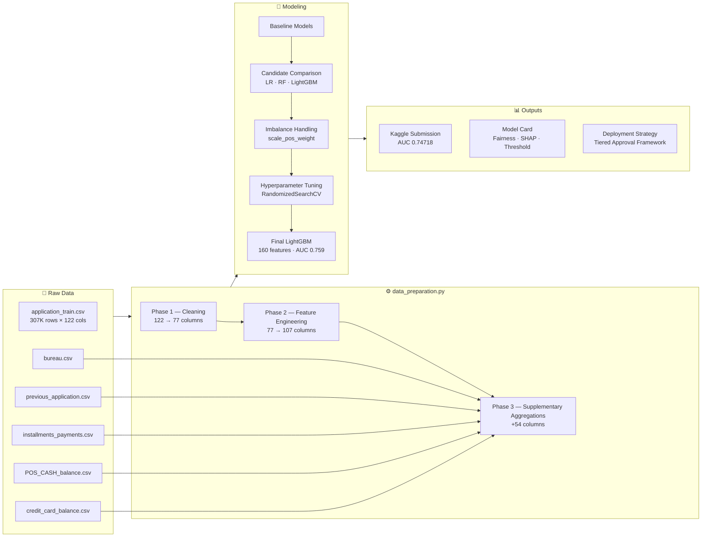
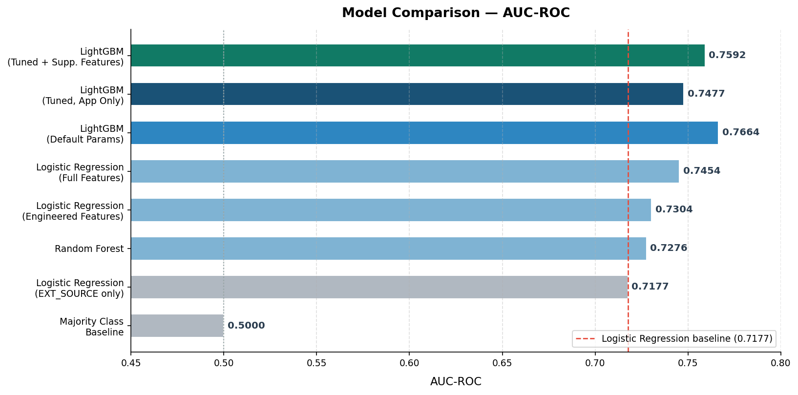
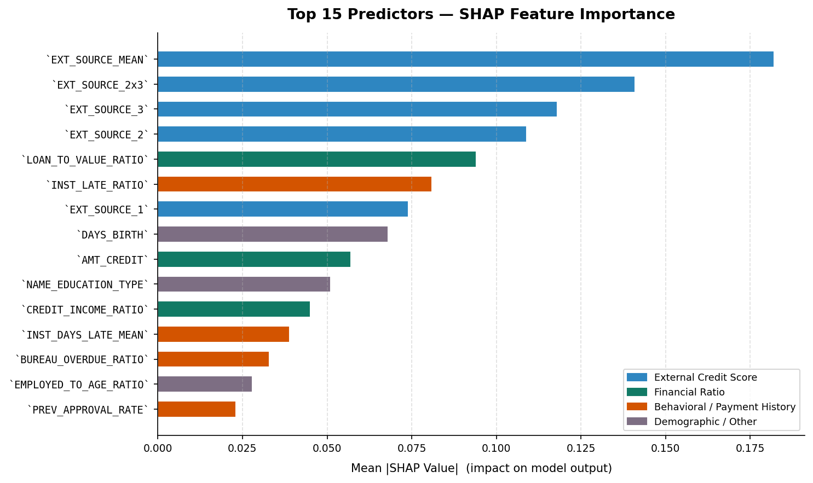

# Home Credit Default Risk — Predictive Credit Scoring for Underserved Borrowers

**Author:** Benjamin Hogan
**Tools:** Python · Polars · LightGBM · SHAP · Quarto
**Kaggle AUC-ROC:** 0.74718 &nbsp;|&nbsp; **Estimated Business Value:** +$47.3M over approve-all baseline

---

## Project Overview

Approximately 1.7 billion adults worldwide lack access to formal financial services, often not because they are poor credit risks, but simply because they lack a credit history. Home Credit Group serves this population — but without reliable repayment signals, the company faces a difficult tradeoff: approve too liberally and absorb default losses; approve too conservatively and leave profitable borrowers on the table.

This project builds an end-to-end machine learning pipeline to address that tradeoff directly. Using application data, credit bureau records, and behavioral payment histories, the model identifies thin-file applicants who are likely to repay — enabling Home Credit to extend credit confidently to borrowers who would otherwise be rejected.

The deliverables go beyond a Kaggle score. The project includes a production-oriented data preparation module, a full model card with fairness analysis and regulatory considerations, and a business-grounded threshold analysis that translates model output into a concrete lending strategy with estimated financial impact.

- **Problem Type:** Binary classification (imbalanced — ~8% default rate)
- **Target Variable:** `TARGET` (1 = default, 0 = repaid on time)
- **Primary Metric:** AUC-ROC (chosen for robustness to class imbalance)
- **Training Data:** 307,511 loan applications × 122 features
- **Test Data:** 48,744 loan applications × 121 features

---

## Business Value

The model's value is not just predictive — it is financial and operational. A poorly calibrated lending strategy costs money in two ways: lost revenue from rejected creditworthy applicants, and default losses from approved high-risk ones. This project quantifies both.

Using industry cost benchmarks (McKinsey, 2020; Moody's, 2019):

- **Profit per repaid loan:** ~$934
- **Loss per default:** ~$10,500 (11.2× ratio)
- **Optimal decision threshold:** 0.63 — the point that maximizes expected net value across the applicant pool

At threshold 0.63, the model is estimated to generate approximately **$50.5M in net value** on the test population — a **$47.3M improvement** over the naive baseline of approving every applicant. The recommended deployment strategy is tiered:

| Score Band | Action | Rationale |
|---|---|---|
| Below 0.50 | Auto-approve | Low predicted risk; high expected profit |
| 0.50 – 0.75 | Human review | Borderline cases; underwriter judgment adds value |
| Above 0.75 | Auto-deny | High predicted default risk; expected net loss |

This framework gives underwriters a practical tool — not just a model — and clearly communicates where automation is appropriate and where human judgment should be preserved.

---

## Results at a Glance

| Metric | Value |
|---|---|
| Kaggle Public Leaderboard AUC-ROC | **0.74718** |
| Cross-Validation AUC-ROC | 0.759 |
| Precision (at threshold 0.63) | 0.241 |
| Recall (at threshold 0.63) | 0.412 |
| Approval Rate (at threshold 0.63) | 86.2% |
| Estimated Net Value vs. approve-all baseline | **+$47.3M** |

The gap between CV AUC (0.759) and Kaggle AUC (0.747) is small and consistent with normal generalization — there is no evidence of overfitting.

---

## Pipeline at a Glance



---

## Repository Structure

```
home-credit-project/
├── README.md                  # This file
├── data_preparation.py        # Reusable cleaning & feature engineering module
├── modeling_notebook.qmd      # End-to-end modeling workflow (Quarto source)
├── model_card.qmd             # Structured model card (Quarto source)
└── home-credit-default-risk/  # Raw Kaggle data (not tracked in git)
    ├── application_train.csv
    ├── application_test.csv
    ├── bureau.csv
    ├── previous_application.csv
    ├── installments_payments.csv
    ├── POS_CASH_balance.csv
    └── credit_card_balance.csv
```

---

## Modeling Workflow (`modeling_notebook.qmd`)

The modeling notebook documents a deliberate, staged process — each decision is justified, not just reported. The goal was to arrive at the best-performing model through a reproducible, explainable workflow rather than trial and error.

### Stage 1 — Establishing Baselines

Before any real modeling, two baselines establish the performance floor:

| Model | AUC-ROC |
|---|---|
| Majority class classifier (always predicts 0) | 0.5000 |
| Logistic Regression — EXT_SOURCE features only | 0.7177 |

The majority class classifier achieves ~92% accuracy — but an AUC of 0.50, equivalent to random guessing. This demonstrates clearly why **accuracy alone is a misleading metric** for imbalanced classification problems like this one. Any model worth deploying must beat 0.7177, the score achievable with just three external credit bureau scores.

### Stage 2 — Candidate Model Comparison

Four model families were evaluated head-to-head using 3-fold stratified cross-validation on the full engineered feature set. Stratification preserves the ~8% default rate across all folds, ensuring the evaluation reflects real-world class distribution.

| Model | Mean AUC-ROC | Std |
|---|---|---|
| **LightGBM (default params)** | **0.7664** | 0.0016 |
| Logistic Regression — full features | 0.7454 | 0.0022 |
| Logistic Regression — engineered features only | 0.7304 | 0.0029 |
| Random Forest | 0.7276 | 0.0013 |



LightGBM was the clear winner, outperforming all alternatives by a meaningful margin. Its advantages for this dataset are significant: it handles missing values natively (critical given the high missingness in EXT_SOURCE columns), captures non-linear interactions without explicit engineering, and scales efficiently to 300K+ rows. Notably, logistic regression on the full raw feature set outperformed the engineered-features-only variant — suggesting the raw features carry signal that derived ratios alone do not fully capture.

### Stage 3 — Class Imbalance Handling

With only ~8% of loans defaulting, a naive model will learn to ignore the minority class. Five strategies were benchmarked on a 10,000-row stratified subsample using LightGBM as the base model:

| Strategy | Mean AUC-ROC |
|---|---|
| **Random undersampling** | **0.7097** |
| SMOTE (synthetic oversampling) | 0.7061 |
| No adjustment | 0.6956 |
| Random oversampling | 0.6915 |
| Class weights (`scale_pos_weight`) | 0.6903 |

Random undersampling produced the best AUC on the subsample. However, subsample results carry high variance, and `scale_pos_weight` — which integrates natively into LightGBM's objective function without modifying the training data — performed competitively and was carried forward into full-dataset tuning where it proved more stable.

### Stage 4 — Hyperparameter Tuning

Randomized search over 20 parameter combinations with 3-fold CV was run on a 5,000-row subsample to efficiently explore the parameter space without the computational cost of full-dataset grid search. The best parameters were then applied to a final model trained on all 307,511 rows.

| Feature Set | Mean AUC-ROC | Std |
|---|---|---|
| Tuned LightGBM — application features only | 0.7477 | 0.0026 |
| Tuned LightGBM + supplementary features | **0.7592** | 0.0024 |

### Stage 5 — Supplementary Feature Engineering

The application form alone captures a snapshot in time. Real credit risk also lives in behavioral history — how a borrower has managed past obligations. Five supplementary tables from Home Credit's records were aggregated to the applicant level and joined to the main feature matrix, adding 54 new features (107 → 161 columns total):

| Table | Features Added | Key Signals |
|---|---|---|
| `bureau.csv` | 15 | Overdue counts, debt/credit ratios, active loan recency |
| `previous_application.csv` | 12 | Approval/refusal rates, prior credit amounts |
| `installments_payments.csv` | 12 | Late payment ratio, underpayment behavior |
| `POS_CASH_balance.csv` | 7 | DPD counts, late payment ratio |
| `credit_card_balance.csv` | 10 | Utilization rate, drawing behavior, CC DPD |

Adding supplementary features improved CV AUC from **0.7477 → 0.7592** (+0.0115) — confirming that behavioral payment history adds meaningful predictive signal beyond the application form alone. This is especially important for thin-file borrowers, where credit bureau scores may be missing or sparse.

---

## Model Card (`model_card.qmd`)

The model card is a structured, nine-section document that goes beyond performance metrics to address the full lifecycle of a deployed credit model — intended use, fairness, regulatory risk, and business recommendations. It is written as a professional deliverable: code is hidden, outputs are displayed, and the language is accessible to non-technical stakeholders including compliance officers, product managers, and executives.

| Section | Summary |
|---|---|
| **1. Model Details** | LightGBM gradient-boosted classifier, v1.0 (March 2026); trained on 160 features with tuned hyperparameters and `scale_pos_weight` for class imbalance |
| **2. Intended Use** | First-pass credit screening tool for Home Credit underwriters. Designed to flag low-risk applicants for approval and high-risk applicants for review or denial — not for fraud detection, portfolio stress testing, or fully automated decisions |
| **3. Performance Metrics** | CV AUC-ROC: 0.759 · Kaggle AUC-ROC: 0.747 · Precision: 0.241 · Recall: 0.412 · Approval rate: 86.2% at threshold 0.63 |
| **4. Decision Threshold Analysis** | Financial cost assumptions drawn from McKinsey (2020) and Moody's (2019): ~$934 profit per repaid loan, ~$10,500 loss per default (11.2× asymmetry). Threshold of 0.63 maximizes expected net value at ~$50.5M — a **$47.3M improvement** over approving all applicants |
| **5. Explainability** | SHAP analysis run on a 1,000-row stratified sample. See chart below. Top predictors: `EXT_SOURCE_MEAN` (composite external credit score), `EXT_SOURCE_2x3` (interaction term), `LOAN_TO_VALUE_RATIO`, `INST_LATE_RATIO` (installment payment behavior), and `NAME_EDUCATION_TYPE` |
| **6. Adverse Action Mapping** | Top SHAP-ranked features translated into ECOA-compliant plain-language denial reasons suitable for adverse action notices (e.g., "limited external credit history", "pattern of late installment payments") |
| **7. Fairness Analysis** | Female applicants approved at 88.4% vs. 81.9% for male — the gap aligns with a 3.1pp difference in actual default rates. The education approval gap (91.9% for higher education vs. 81.7% for lower secondary) exceeds the underlying default rate gap and is flagged for disparate impact monitoring |
| **8. Limitations & Risks** | Missing EXT_SOURCE scores for new borrowers with no bureau history; model trained on a static snapshot (no drift monitoring); uncalibrated probabilities; feedback loop risk from deployment; regulatory exposure from gender and education as direct model inputs |
| **9. Executive Summary** | Recommended deployment as a tiered screening tool: auto-approve below 0.50, human review 0.50–0.75, auto-deny above 0.75. Key caveats: model misses 59% of actual defaults at this threshold; financial estimates rely on industry benchmarks rather than internal figures; gender use as a direct feature requires legal review before production deployment |



---

## Data Preparation Module (`data_preparation.py`)

A production-oriented, reusable Python module for cleaning, transforming, and engineering features from the Home Credit dataset. The central design principle is **train/test consistency**: all fit parameters (imputation medians, column lists) are computed exclusively from training data and passed explicitly to the test pipeline — preventing any form of data leakage.

The module is fully documented with NumPy-style docstrings and is designed to be importable into any downstream notebook or script without modification.

### Installation

Requires Python 3.10+ and the following packages:

```bash
pip install polars scikit-learn lightgbm imbalanced-learn
```

### Quick Start

```python
import polars as pl
from data_preparation import (
    fit_params_from_train,
    prepare_application_data,
    aggregate_bureau,
    aggregate_previous_application,
    aggregate_installments,
    join_supplementary_features,
)

# Load raw data
train = pl.read_csv("home-credit-default-risk/application_train.csv")
test  = pl.read_csv("home-credit-default-risk/application_test.csv")

# Step 1: Fit parameters from training data ONLY
params = fit_params_from_train(train)

# Step 2: Apply the full cleaning + engineering pipeline
train_prepared = prepare_application_data(train, params, is_train=True)
test_prepared  = prepare_application_data(test,  params, is_train=False)

# Step 3: Aggregate supplementary behavioral tables
bureau_agg = aggregate_bureau(pl.read_csv("home-credit-default-risk/bureau.csv"))
prev_agg   = aggregate_previous_application(pl.read_csv("home-credit-default-risk/previous_application.csv"))
inst_agg   = aggregate_installments(pl.read_csv("home-credit-default-risk/installments_payments.csv"))

# Step 4: Join all features into final modeling datasets
train_final = join_supplementary_features(train_prepared, bureau_agg, prev_agg, inst_agg)
test_final  = join_supplementary_features(test_prepared,  bureau_agg, prev_agg, inst_agg)
```

---

## Pipeline Stages

### Phase 1 — Cleaning (`clean_application_data`)

Raw Home Credit data contains a number of known data quality issues that must be resolved before modeling. Each transformation is handled explicitly and documented:

| Transformation | Description |
|---|---|
| `DAYS_EMPLOYED` sentinel | The value 365,243 is a known placeholder for unemployed applicants — replaced with null; a binary `DAYS_EMPLOYED_ANOM` flag is added to preserve the signal |
| `AGE_YEARS` | `DAYS_BIRTH` is stored as a negative integer — converted to positive years |
| `CODE_GENDER "XNA"` | Four rows with gender coded as "XNA" are replaced with null |
| `OWN_CAR_AGE` | Null values for applicants who do not own a car are filled with 0 |
| EXT_SOURCE imputation | `EXT_SOURCE_1` (56% missing), `EXT_SOURCE_2` (0.2%), and `EXT_SOURCE_3` (19.8%) are median-imputed using **training medians only** |
| `OCCUPATION_TYPE` | Null values filled with "Unknown" to preserve rows while flagging missing information |
| Housing columns | 47 columns with >50% missing data are dropped as too sparse to be reliably useful |
| Credit bureau inquiries | Six `AMT_REQ_CREDIT_BUREAU_*` columns are filled with 0 where null (no inquiry = zero inquiries) |

**Result:** 122 raw columns reduced to 77 clean columns.

### Phase 2 — Feature Engineering (`engineer_features`)

Domain-informed features are derived from the cleaned application data to give the model richer signals than raw columns alone provide:

| Category | Features |
|---|---|
| **Demographics** | `EMPLOYED_YEARS`, `REGISTRATION_YEARS`, `ID_PUBLISH_YEARS`, `PHONE_CHANGE_YEARS`, `EMPLOYED_TO_AGE_RATIO` — temporal context and stability signals |
| **Financial Ratios** | `CREDIT_INCOME_RATIO`, `ANNUITY_INCOME_RATIO`, `LOAN_TO_VALUE_RATIO`, `CREDIT_TERM_MONTHS`, `GOODS_TO_INCOME_RATIO` — affordability and debt burden indicators |
| **Missing Indicators** | Binary flags for columns where missingness itself carries predictive signal (e.g., no goods price may indicate a specific loan type) |
| **EXT_SOURCE Interactions** | `EXT_SOURCE_MEAN`, `EXT_SOURCE_1x2`, `EXT_SOURCE_1x3`, `EXT_SOURCE_2x3`, `EXT_SOURCE_1_SQ`, `EXT_SOURCE_2_SQ`, `EXT_SOURCE_3_SQ` — polynomial and cross-score interactions that capture non-linear relationships between the three strongest predictors |
| **Binned Variables** | `AGE_BIN` (5-year brackets), `CREDIT_INCOME_BIN` (quartile), `EXT_SOURCE_MEAN_BIN` (quartile) — discretized versions for interpretability and non-linear effects |

### Phase 3 — Supplementary Aggregations

Each supplementary table is aggregated from long format (one row per event) to wide format (one row per applicant) and joined to the main feature matrix:

| Function | Prefix | Key Engineered Features |
|---|---|---|
| `aggregate_bureau()` | `BUREAU_` | `BUREAU_COUNT`, `BUREAU_ACTIVE_RATIO`, `BUREAU_DEBT_CREDIT_RATIO`, `BUREAU_OVERDUE_RATIO`, `BUREAU_SUM_OVERDUE`, `BUREAU_MAX_OVERDUE`, `BUREAU_MEAN_DAYS_OVERDUE` |
| `aggregate_previous_application()` | `PREV_` | `PREV_APP_COUNT`, `PREV_APPROVAL_RATE`, `PREV_REFUSAL_RATE`, `PREV_AMT_CREDIT_MEAN`, `PREV_CREDIT_REQUEST_RATIO`, `PREV_DAYS_DECISION_MEAN` |
| `aggregate_installments()` | `INST_` | `INST_LATE_RATIO`, `INST_UNDERPAY_RATIO`, `INST_DAYS_LATE_MEAN`, `INST_DAYS_LATE_MAX`, `INST_PAYMENT_RATIO_MEAN`, `INST_AMT_PAYMENT_SUM` |

---

## Tech Stack

| Tool | Purpose |
|---|---|
| **Python 3.10+** | Core language |
| **Polars** | High-performance data wrangling and feature engineering |
| **LightGBM** | Gradient-boosted classifier — final model |
| **scikit-learn** | Cross-validation, metrics, randomized search |
| **imbalanced-learn** | SMOTE and resampling strategies |
| **SHAP** | Model explainability and adverse action mapping |
| **Quarto** | Reproducible reporting (`.qmd` → rendered HTML) |

---

## Data Source

Data is sourced from the [Home Credit Default Risk Kaggle competition](https://www.kaggle.com/c/home-credit-default-risk). The dataset includes application records, credit bureau history, previous loan applications, and behavioral payment data across seven CSV files. Raw files are not tracked in this repository and must be downloaded separately and placed in the `home-credit-default-risk/` directory.
